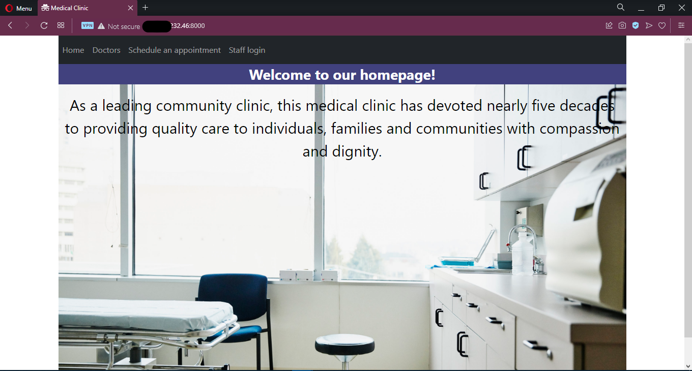

# Django-CRUD-HealthClinic
With this app, you can fully manage a health clinic website. Made with Python in the Django Framework, PostgreSQL using AWS RDS, HTML, CSS, and Bootstrap. Containerized using Docker and Docker compose. The application was successfully deployed to the AWS EC2 instance.

<h2>Key features :</h2>
<ul>
  <li>User registration</li>
  <li>User login</li>
  <li>Admin user authorized pages</li>
  <li>Display all available doctors</li>
  <li>Display all patients</li>
  <li>Display all scheduled appointments</li>
  <li>Appointment search by patient's JMBG</li>
  <li>Appointment deletion</li>
  <li>Appointment editing</li>
  <li>Appointment scheduling</li>
  <li>Appointments printing</li>
  <li>Doctors deletion</li>
  <li>Doctors editing</li>
  <li>Doctors adding</li>
  <li>Doctors printing</li>
  <li>Patients deletion</li>
  <li>Patients editing</li>
  <li>Patients adding</li>
  <li>Patients printing</li>
</ul>
<br>

To get it running on your local machine, run the commands below in your terminal :
<br>

``` 1. $ git clone https://github.com/nemcve/Django-CRUD-HealthClinic.git ``` 
<br> 

``` 2. $ cd Django-CRUD-HealthClinic ```
<br>

``` 3. Generate a secret key using https://djecrety.ir, copy it, and replace it with the existing SECRET_KEY setting in the settings.py file. Then set the DEBUG setting underneath it to True. ```
<br>

```4. Also in the settings.py file, uncomment the db.sqlite3 database connection and delete or comment out the PostgreSQL database connection. ```
<br>

``` 5. $ docker build -t djangoapp . ```
<br>

``` 6. $ docker run -p 8000:8000 djangoapp ```
<br>

``` 7. Open your browser and navigate to http://127.0.0.1:8000/ ```
<br>

``` Admin login username: admin, password: admin ```
<br>
<br>
If you want to create a new admin user :

``` $ cd Django-CRUD-HealthClinic/HealthClinic/ ```
<br>

``` $ python manage.py createsuperuser, and follow the prompts ```
<br>

To access the Django admin control panel and manage users and user groups, in your browser's url field, add /admin. Like this :

``` https://127.0.0.1:8000/admin ```

<h3>Application successfully running on an AWS EC2 instance :</h3>

